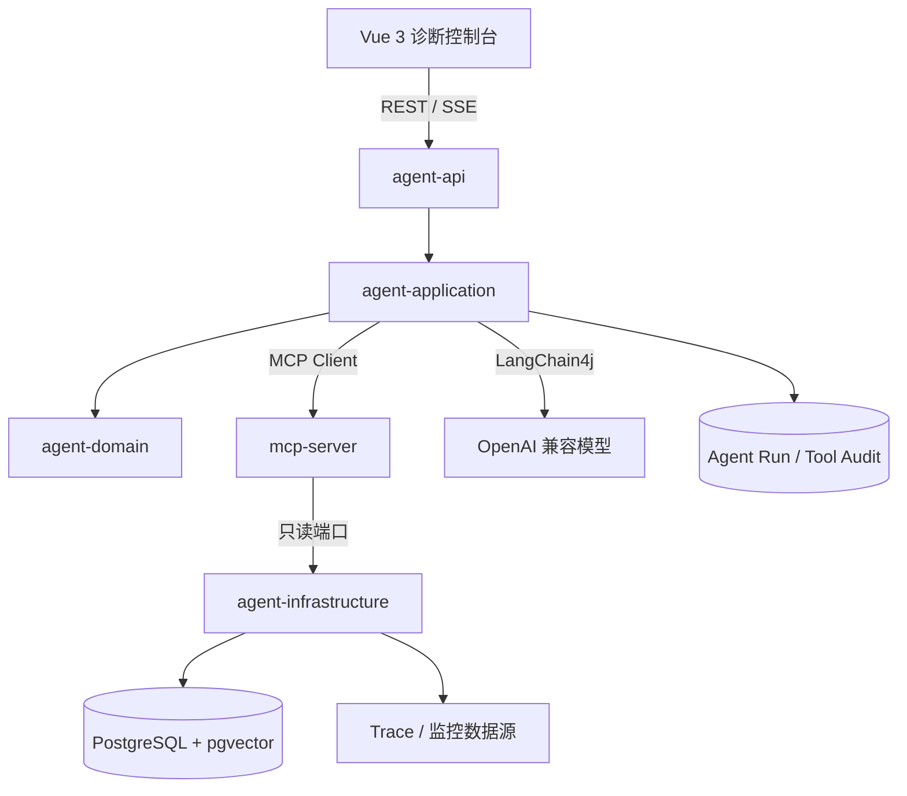
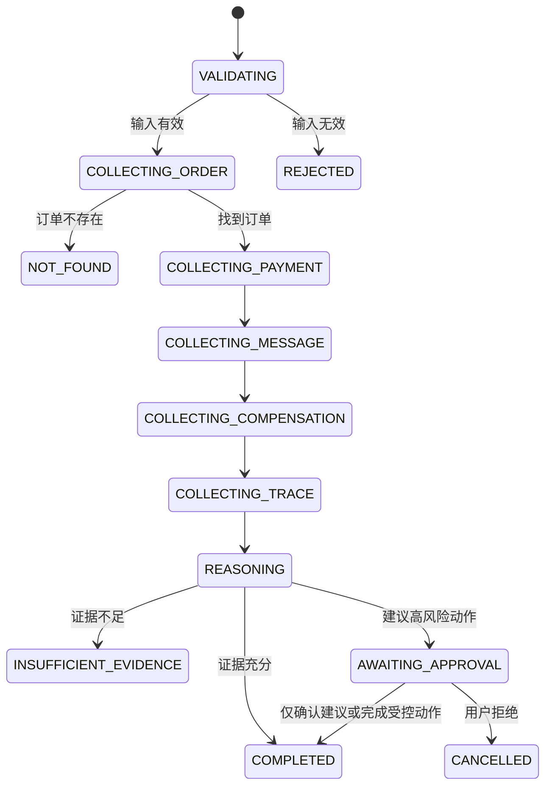

# 支付异常诊断 Agent 项目设计

## 1. 背景与问题

支付异常通常跨越订单、第三方支付、回调、消息队列、状态回写、定时补偿和监控链路。人工排查需要在多个系统间切换，依赖经验判断，并且难以保留完整证据。

本项目使用确定性工作流、受控工具调用和大模型推理协作完成诊断。模型负责在明确边界内选择工具、解释证据和组织结论；事实查询、权限、审计、停止条件和补偿审批由代码控制。

## 2. 设计目标

### 2.1 业务目标

输入订单号或支付流水号后：

1. 收集订单、支付、消息、补偿任务和 Trace 证据；
2. 判断异常发生在哪个支付阶段；
3. 输出证据、判断依据和处置建议；
4. 在信息不完整时明确返回证据不足；
5. 对可能改变资金状态的操作要求人工确认。

### 2.2 工程目标

- Java 21 与 Spring Boot 3 构建生产级服务边界；
- LangChain4j 接入 OpenAI 兼容模型；
- Java MCP Server 对外暴露受控诊断工具；
- PostgreSQL 存储业务演示数据、Agent 审计和评测数据；
- pgvector 支持故障手册和支付流程知识检索；
- Vue 3 + TypeScript 提供执行过程与证据展示；
- 每项 Agent 能力都有可运行验证和评测指标。

## 3. 非目标

当前阶段不追求：

- 直接连接真实生产支付系统；
- 自动执行退款、补单或资金补偿；
- 开放任意 SQL、Shell、文件系统或网络访问；
- 没有可测收益的多 Agent 架构；
- 用固定文本或 Mock 结果包装成可用诊断能力；
- Kubernetes、云部署和生产级身份系统。

## 4. 总体架构

核心决策：

- `agent-api` 与 `mcp-server` 是两个独立进程；
- 前端只访问 `agent-api`；
- `agent-api` 不直接让模型访问数据库；
- 数据查询通过应用端口和 MCP 白名单工具完成；
- Agent 结论必须引用工具结果或知识来源；
- 高风险操作由确定性代码和人工审批控制。

## 5. 模块设计

### 5.1 `agent-domain`

职责：

- 订单与支付状态；
- 消息和补偿任务状态；
- `DiagnosisStage`；
- `DiagnosisEvidence`；
- 诊断结果及领域不变量。

约束：

- 纯 Java；
- 不依赖 Spring、LangChain4j、MCP SDK 或数据库；
- 不执行 I/O；
- 不包含 API DTO 或 JPA 实体。

### 5.2 `agent-application`

职责：

- 诊断用例；
- 工作流状态转换；
- 查询、推理、审计和人工确认端口；
- 诊断停止条件；
- 工具结果到领域证据的转换。

建议端口：

- `OrderQueryPort`
- `PaymentQueryPort`
- `MessageQueryPort`
- `CompensationQueryPort`
- `TraceQueryPort`
- `DiagnosisReasoningPort`
- `AgentRunRepository`
- `ApprovalPort`

这些端口在对应纵向切片实现时创建，不提前生成无调用者的空抽象。

### 5.3 `agent-infrastructure`

职责：

- PostgreSQL 数据访问；
- pgvector 检索；
- LangChain4j 模型配置；
- MCP Client 或外部接口适配；
- Agent Run、工具调用和审批审计；
- 外部调用的超时、错误映射和重试。

模型配置采用显式开关：

- `app.ai.enabled=false`：基础服务可启动，不创建模型；
- `app.ai.enabled=true`：必须提供 Base URL、API Key 和模型名；
- 缺少配置时启动失败，不能回退到假回答。

### 5.4 `agent-api`

职责：

- REST 请求与响应；
- SSE 事件流；
- 参数校验；
- 错误码和错误响应；
- 应用装配；
- 健康与状态接口。

后续接口草案：

| 接口 | 用途 |
|---|---|
| `POST /api/diagnoses` | 创建诊断任务 |
| `GET /api/diagnoses/{runId}` | 查询当前诊断状态和结果 |
| `GET /api/diagnoses/{runId}/events` | SSE 订阅执行轨迹 |
| `POST /api/diagnoses/{runId}/approvals/{approvalId}` | 提交人工审批决定 |

接口名称和 Schema 在实现切片时通过契约测试确定。

### 5.5 `mcp-server`

职责：

- 提供 Streamable HTTP `/mcp`；
- 声明工具能力；
- 注册只读、强类型、可审计工具；
- 将业务错误映射为稳定的工具结果。

计划工具：

| Tool | 输入 | 输出 | 权限 |
|---|---|---|---|
| `get_order` | `orderId` | 订单摘要和状态 | 只读 |
| `get_payment_transactions` | `orderId` 或 `transactionId` | 支付流水列表 | 只读 |
| `get_message_delivery` | `orderId` | 发送和消费结果 | 只读 |
| `get_compensation_tasks` | `orderId` | 补偿任务状态 | 只读 |
| `get_trace_summary` | `traceId` 或业务关联 ID | 脱敏链路摘要 | 只读 |

禁止提供 `execute_sql` 之类的通用工具。

### 5.6 `frontend`

页面规划：

- 诊断任务创建；
- Agent 执行阶段；
- 工具调用时间线；
- 证据列表和来源；
- 异常阶段与处置建议；
- 证据不足状态；
- 人工审批；
- Token、延迟和工具调用统计。

前端不保存服务端密钥，不直接调用 MCP Server 或数据库。

## 6. 诊断工作流

建议使用显式状态机而不是开放式无限 Agent 循环：

工作流约束：

- 每一步记录开始、结束、耗时和状态；
- 工具失败区分可重试与不可重试；
- 重试次数有上限；
- Agent 总步骤和总耗时有上限；
- 收集阶段保留原始脱敏证据；
- 推理结果不能覆盖事实证据；
- 任一必要数据源不可用时标记诊断完整度。

## 7. 领域模型

建议逐步引入：

### 7.1 业务实体

- `OrderSnapshot`
- `PaymentTransaction`
- `MessageDelivery`
- `CompensationTask`
- `TraceSummary`

### 7.2 Agent 实体

- `DiagnosisRun`
- `DiagnosisEvidence`
- `ToolInvocation`
- `DiagnosisConclusion`
- `ApprovalRequest`

### 7.3 诊断阶段

阶段应对应可解释的支付链路，例如：

- 订单创建；
- 支付发起；
- 第三方支付处理；
- 支付回调；
- 订单状态回写；
- 消息投递；
- 消息消费；
- 补偿执行；
- 无法判断。

## 8. 数据设计

建议按职责分表：

### 8.1 演示业务数据

- `orders`
- `payment_transactions`
- `message_deliveries`
- `compensation_tasks`
- `trace_summaries`

### 8.2 Agent 审计

- `diagnosis_runs`
- `diagnosis_evidence`
- `tool_invocations`
- `approval_requests`
- `model_invocations`

### 8.3 RAG

- `knowledge_documents`
- `knowledge_chunks`

向量维度必须与实际 Embedding 模型一致。更换模型时应通过数据库迁移修改维度并重建向量，不能仅修改环境变量。

## 9. RAG 设计

知识源优先选择：

- 支付状态机说明；
- 异常处理手册；
- 回调和补偿规则；
- 消息主题说明；
- 监控告警处理流程。

检索结果必须包含：

- 文档 ID；
- 来源 URI；
- 章节；
- 原文片段；
- 检索分数；
- 文档版本或更新时间。

回答必须引用来源。无匹配知识时不能让模型根据常识补出企业内部规则。

## 10. MCP 与模型边界

模型可以：

- 根据上下文选择已注册工具；
- 对工具结果进行归纳；
- 解释不同证据之间的关系；
- 生成处置建议草案。

模型不可以：

- 访问未注册数据源；
- 修改工具参数 Schema；
- 直接执行 SQL；
- 跳过审批执行补偿；
- 将未经工具验证的内容当成事实；
- 提升自身权限。

## 11. 安全设计

- 工具最小权限和只读数据库账号；
- 输入长度、格式和字符集校验；
- SQL 使用固定查询或参数化仓储方法；
- 手机号、身份证、银行卡和支付凭据脱敏；
- Prompt Injection 只作为不可信业务文本处理；
- API、MCP、模型和数据库调用使用关联 ID；
- 审计记录不保存密钥和完整敏感数据；
- 补偿建议与补偿执行分离；
- 任何执行动作都需要审批、幂等键和完整审计。

## 12. 错误模型

统一区分：

- 输入错误；
- 业务对象不存在；
- 工具无权限；
- 上游不可用；
- 工具超时；
- 证据不足；
- 模型不可用；
- 成本或步骤超限；
- 审批拒绝。

前端和评测系统必须能够识别这些状态，不能全部折叠成通用失败。

## 13. 可观测性

每个诊断任务记录：

- `runId` 和关联业务 ID；
- 工作流状态变化；
- 每次工具调用的输入摘要、结果状态和耗时；
- 模型名、Prompt 版本、Token、延迟和费用；
- 检索查询、文档来源和分数；
- 最终结论、证据和人工审批结果。

日志、指标和 Trace 均不得包含完整敏感数据。

## 14. 评测设计

固定用例至少覆盖：

1. 订单不存在；
2. 下单成功但支付未发起；
3. 第三方支付成功但回调未处理；
4. 回调成功但订单未更新；
5. 消息发送失败；
6. 消息消费失败；
7. 补偿任务未执行；
8. Trace 数据缺失；
9. 工具无权限；
10. 输入中包含 Prompt Injection。

指标：

- 异常阶段判断准确率；
- 工具选择正确率；
- 工具参数正确率；
- 任务成功率；
- 无依据结论率；
- 平均工具调用次数；
- P50/P95 延迟；
- Token 与单任务成本；
- 人工确认拦截次数。

## 15. 测试策略

- Domain：领域不变量和状态转换；
- Application：用例、错误映射、停止条件和审批状态；
- Infrastructure：Testcontainers 验证 PostgreSQL、迁移和查询；
- MCP：工具 Schema、正常调用、输入错误、权限不足和上游失败；
- API：请求/响应契约与 SSE 事件顺序；
- Frontend：关键状态、事件流和审批交互；
- E2E：真实启动 API、MCP、数据库和前端完成诊断用例；
- Evals：模型或 Prompt 变更前后运行同一数据集。

## 16. 当前实现状态

已实现：

- Maven 五模块结构；
- 基础领域证据和诊断阶段；
- OpenAI 兼容 LangChain4j 配置边界；
- Agent API 状态接口；
- Java MCP Streamable HTTP 初始化；
- Vue 状态页面；
- pgvector Compose 与初始化 SQL；
- Java 单元/接口测试和前端构建。

未实现：

- 支付业务数据模型和迁移；
- 订单及支付查询；
- MCP 业务工具；
- Agent 工作流和 SSE；
- 人工审批；
- RAG；
- Agent 评测与完整可观测性。

具体实施顺序见[开发路线](../roadmap/development-roadmap.md)。
