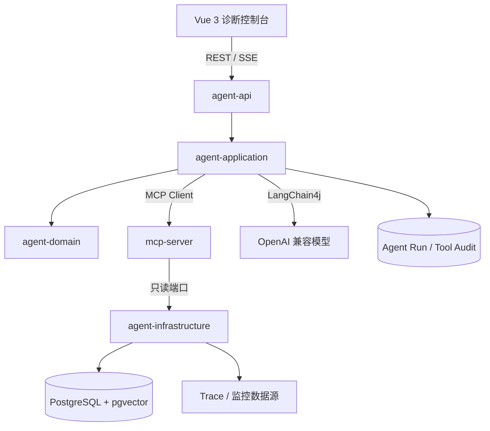
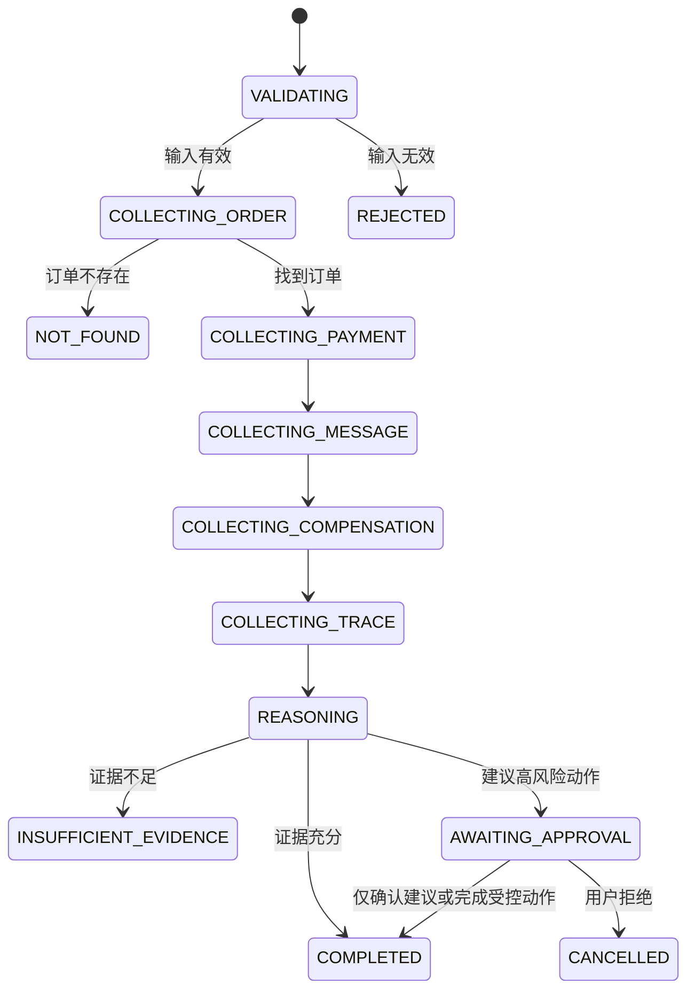

# 支付异常诊断 Agent 项目设计

## 1. 背景与问题

支付异常通常跨越订单、第三方支付、回调、消息队列、状态回写、定时补偿和监控链路。人工排查需要在多个系统间切换，依赖经验判断，并且难以保留完整证据。

本项目使用确定性工作流、受控工具调用和大模型推理协作完成诊断。模型负责在明确边界内选择工具、解释证据和组织结论；事实查询、权限、审计、停止条件和补偿审批由代码控制。

## 2. 设计目标

### 2.1 业务目标

输入订单号或支付流水号后：

1. 收集订单、支付、消息、补偿任务和 Trace 证据；
2. 判断异常发生在哪个支付阶段；
3. 输出证据、判断依据和处置建议；
4. 在信息不完整时明确返回证据不足；
5. 对可能改变资金状态的操作要求人工确认。

### 2.2 工程目标

- Java 21 与 Spring Boot 3 构建生产级服务边界；
- LangChain4j 接入 OpenAI 兼容模型；
- Java MCP Server 对外暴露受控诊断工具；
- PostgreSQL 存储业务演示数据、Agent 审计和评测数据；
- pgvector 支持故障手册和支付流程知识检索；
- Vue 3 + TypeScript 提供执行过程与证据展示；
- 每项 Agent 能力都有可运行验证和评测指标。

## 3. 非目标

当前阶段不追求：

- 直接连接真实生产支付系统；
- 自动执行退款、补单或资金补偿；
- 开放任意 SQL、Shell、文件系统或网络访问；
- 没有可测收益的多 Agent 架构；
- 用固定文本或 Mock 结果包装成可用诊断能力；
- Kubernetes、云部署和生产级身份系统。

## 4. 总体架构

核心决策：

- `agent-api` 与 `mcp-server` 是两个独立进程；
- 前端只访问 `agent-api`；
- `agent-api` 不直接让模型访问数据库；
- 数据查询通过应用端口和 MCP 白名单工具完成；
- Agent 结论必须引用工具结果或知识来源；
- 高风险操作由确定性代码和人工审批控制。

## 5. 模块设计

### 5.1 `agent-domain`

已实现不可变领域类型：

- `OrderId`、`OrderStatus`、`OrderRole`、`OrderSnapshot`；
- `PaymentTransaction`、`PaymentStatus`；
- `MessageDelivery`、`MessageDeliveryStatus`；
- `CompensationTask`、`CompensationStatus`；
- `TraceSummary`；
- `DiagnosisEvidence`（含稳定证据 ID）、`DiagnosisResult`、`DiagnosisRuleId`、`DiagnosisStage`、`DataMode`。

领域不变量：

- 标识符非空、去首尾空白且长度有上限；
- 金额使用 `BigDecimal`，不得为负；
- 商品数量大于零；
- 更新时间不得早于创建时间；
- 子订单必须有主订单号，单订单和主订单不得错误携带主订单号；
- 重试次数不得为负且不得大于最大重试次数；
- 每个诊断结论至少引用一条证据（`NO_KNOWN_EXCEPTION` 和 `INSUFFICIENT_EVIDENCE` 除外）。

约束：

- 纯 Java；
- 不依赖 Spring、LangChain4j、MCP SDK 或数据库；
- 不执行 I/O；
- 不包含 API DTO 或 JPA 实体。

### 5.2 `agent-application`

已实现：

- 五类只读查询端口：`OrderQueryPort`、`PaymentQueryPort`、`MessageQueryPort`、`CompensationQueryPort`、`TraceQueryPort`；
- `FactQueryException`（区分 `UNAVAILABLE` 和 `TIMEOUT`）；
- `GetOrderUseCase`：构造 `OrderId` 并查询，找不到抛 `OrderNotFoundException`；
- `DiagnosePaymentExceptionUseCase`：固定顺序收集五类事实后委托规则引擎；
- `DeterministicDiagnosisRules`：按优先级运行 15 条确定性诊断规则；
- `DiagnosisPolicy`：配置支付处理超时和消息消费超时阈值；
- `CollectedFacts`：不可变事实集合。

固定诊断流程：

1. 校验订单号；
2. 查询订单（不存在则短路返回 404）；
3. 查询关联支付流水；
4. 查询消息投递事实；
5. 查询补偿任务事实；
6. 查询 Trace 摘要；
7. 将每条事实转换为可追溯证据；
8. 按优先级运行确定性规则；
9. 返回阶段、规则编号、证据和数据模式。

尚未实现：

- `DiagnosisReasoningPort`（模型推理端口）；
- `AgentRunRepository`（Agent 运行审计）；
- `ApprovalPort`（人工审批端口）。

### 5.3 `agent-infrastructure`

已实现：

- `SimulationConfiguration`（`@Profile("simulation")`）：创建 `SimulationFactStore` 和五个端口 Bean；
- `SimulationScenarioLoader`：从版本化 JSON 场景文件加载事实，映射 DTO 到领域对象，验证失败时包含逻辑 ID 不暴露文件路径；
- `SimulationFactStore`：不可变五端口事实存储，按 `OrderId` 分组索引，查询前检查配置的故障；
- `AiModelConfiguration`：LangChain4j OpenAI 兼容模型配置（`app.ai.enabled=true` 时创建）。

尚未实现：

- PostgreSQL 数据访问适配器；
- pgvector 检索；
- MCP Client；
- Agent Run、工具调用和审批审计。

模型配置采用显式开关：

- `app.ai.enabled=false`：基础服务可启动，不创建模型；
- `app.ai.enabled=true`：必须提供 Base URL、API Key 和模型名；
- 缺少配置时启动失败，不能回退到假回答。

### 5.4 `agent-api`

已实现：

- `GET /api/status`：状态检查（所有 profile）；
- `GET /api/orders/{orderId}`：订单查询（仅 `simulation` profile），返回脱敏订单事实；
- `GET /api/diagnoses/orders/{orderId}`：诊断查询（仅 `simulation` profile），返回 `dataMode`、`stage`、`ruleId`、`evidence[]` 和 `warnings[]`；
- `ApiExceptionHandler`：稳定错误响应，不暴露堆栈/SQL/路径；
- `DiagnosticUseCaseConfiguration`：`@Profile("simulation")` 装配诊断用例 Bean。

已实现错误响应：

| 错误码 | HTTP 状态 | 触发条件 |
|---|---|---|
| `INVALID_ORDER_ID` | 400 | 订单号不合法 |
| `ORDER_NOT_FOUND` | 404 | 订单不存在 |
| `FACT_SOURCE_UNAVAILABLE` | 503 | 数据源不可用 |
| `FACT_SOURCE_TIMEOUT` | 503 | 数据源超时 |

尚未实现：

- SSE 事件流；
- 诊断任务创建和管理；
- 人工审批接口。

### 5.5 `mcp-server`

职责：

- 提供 Streamable HTTP `/mcp`；
- 声明工具能力；
- 注册只读、强类型、可审计工具；
- 将业务错误映射为稳定的工具结果。

计划工具：

| Tool | 输入 | 输出 | 权限 |
|---|---|---|---|
| `get_order` | `orderId` | 订单摘要和状态 | 只读 |
| `get_payment_transactions` | `orderId` 或 `transactionId` | 支付流水列表 | 只读 |
| `get_message_delivery` | `orderId` | 发送和消费结果 | 只读 |
| `get_compensation_tasks` | `orderId` | 补偿任务状态 | 只读 |
| `get_trace_summary` | `traceId` 或业务关联 ID | 脱敏链路摘要 | 只读 |

禁止提供 `execute_sql` 之类的通用工具。

### 5.6 `frontend`

页面规划：

- 诊断任务创建；
- Agent 执行阶段；
- 工具调用时间线；
- 证据列表和来源；
- 异常阶段与处置建议；
- 证据不足状态；
- 人工审批；
- Token、延迟和工具调用统计。

前端不保存服务端密钥，不直接调用 MCP Server 或数据库。

## 6. 诊断工作流

建议使用显式状态机而不是开放式无限 Agent 循环：

工作流约束：

- 每一步记录开始、结束、耗时和状态；
- 工具失败区分可重试与不可重试；
- 重试次数有上限；
- Agent 总步骤和总耗时有上限；
- 收集阶段保留原始脱敏证据；
- 推理结果不能覆盖事实证据；
- 任一必要数据源不可用时标记诊断完整度。

## 7. 领域模型

### 7.1 业务实体（已实现）

| 类型 | 说明 |
|---|---|
| `OrderId` | 订单标识符，正则 `[A-Za-z0-9._-]{1,64}` |
| `OrderStatus` | 订单状态枚举，对应 `prod_order_user.ORDER_STATE` |
| `OrderRole` | 订单角色：SINGLE / MASTER / SUB |
| `OrderSnapshot` | 订单快照，含金额非负、数量>0、更新时间≥创建时间等不变量 |
| `PaymentTransaction` | 支付流水，FAILED 必须有错误码和摘要 |
| `PaymentStatus` | REQUESTED → PROCESSING → PROVIDER_SUCCEEDED → CALLBACK_RECEIVED / FAILED |
| `MessageDelivery` | 消息投递记录，各状态有时间戳和 lastError 约束 |
| `MessageDeliveryStatus` | PENDING / SENT / SEND_FAILED / CONSUMED / CONSUME_FAILED |
| `CompensationTask` | 补偿任务，重试次数≤最大重试 |
| `CompensationStatus` | PENDING / RUNNING / SUCCEEDED / FAILED / RETRIES_EXHAUSTED |
| `TraceSummary` | 调用链路摘要，traceId 非空 |
| `DiagnosisEvidence` | 诊断证据（id, source, summary, observedAt） |
| `DiagnosisResult` | 诊断结果（orderId, dataMode, stage, ruleId, summary, evidence, warnings） |

### 7.2 诊断阶段（已实现）

| 阶段 | 说明 |
|---|---|
| `ORDER_CREATED` | 订单已创建 |
| `PAYMENT_REQUESTED` | 支付已发起 |
| `PAYMENT_CONFIRMED` | 支付已确认 |
| `PAYMENT_CALLBACK` | 支付回调阶段 |
| `ORDER_STATE_UPDATE` | 订单状态回写 |
| `MESSAGE_DELIVERY` | 消息投递 |
| `COMPENSATION` | 补偿执行 |
| `TRACE_CORRELATION` | 调用链路关联 |
| `COMPLETED` | 正常完成 |
| `INSUFFICIENT_EVIDENCE` | 证据不足 |

### 7.3 Agent 实体（尚未实现）

- `DiagnosisRun`
- `ToolInvocation`
- `DiagnosisConclusion`
- `ApprovalRequest`

## 8. 数据设计

### 8.1 演示业务数据（Flyway V2 已创建）

| 表 | 说明 |
|---|---|
| `orders` | 脱敏订单快照（无客户身份字段） |
| `payment_transactions` | 支付流水 |
| `message_deliveries` | 消息投递 |
| `compensation_tasks` | 补偿任务 |
| `trace_summaries` | 调用链路摘要 |

所有表包含主键、外键（ON DELETE RESTRICT）、CHECK 约束（与 Java 枚举一致）和按订单号查询的索引。

脱敏演示数据 SQL 位于 `deploy/postgres/demo/001_payment_diagnosis_scenarios.sql`，使用 `INSERT ... ON CONFLICT DO UPDATE` 实现幂等。

### 8.2 消息事件契约（已创建）

| 文件 | 说明 |
|---|---|
| `deploy/messaging/payment-events.schema.json` | JSON Schema draft 2020-12，定义事件信封 |
| `deploy/messaging/topology.json` | 厂商无关逻辑拓扑 |

三个逻辑事件：`payment.confirmed`、`order.state-update-requested`、`order.state-updated`。

### 8.3 Agent 审计（尚未实现）

- `diagnosis_runs`
- `diagnosis_evidence`
- `tool_invocations`
- `approval_requests`
- `model_invocations`

### 8.4 RAG（尚未实现）

- `knowledge_documents`
- `knowledge_chunks`

向量维度必须与实际 Embedding 模型一致。更换模型时应通过数据库迁移修改维度并重建向量，不能仅修改环境变量。

## 9. RAG 设计

知识源优先选择：

- 支付状态机说明；
- 异常处理手册；
- 回调和补偿规则；
- 消息主题说明；
- 监控告警处理流程。

检索结果必须包含：

- 文档 ID；
- 来源 URI；
- 章节；
- 原文片段；
- 检索分数；
- 文档版本或更新时间。

回答必须引用来源。无匹配知识时不能让模型根据常识补出企业内部规则。

## 10. MCP 与模型边界

模型可以：

- 根据上下文选择已注册工具；
- 对工具结果进行归纳；
- 解释不同证据之间的关系；
- 生成处置建议草案。

模型不可以：

- 访问未注册数据源；
- 修改工具参数 Schema；
- 直接执行 SQL；
- 跳过审批执行补偿；
- 将未经工具验证的内容当成事实；
- 提升自身权限。

## 11. 安全设计

- 工具最小权限和只读数据库账号；
- 输入长度、格式和字符集校验；
- SQL 使用固定查询或参数化仓储方法；
- 手机号、身份证、银行卡和支付凭据脱敏；
- Prompt Injection 只作为不可信业务文本处理；
- API、MCP、模型和数据库调用使用关联 ID；
- 审计记录不保存密钥和完整敏感数据；
- 补偿建议与补偿执行分离；
- 任何执行动作都需要审批、幂等键和完整审计。

## 12. 错误模型

统一区分：

- 输入错误；
- 业务对象不存在；
- 工具无权限；
- 上游不可用；
- 工具超时；
- 证据不足；
- 模型不可用；
- 成本或步骤超限；
- 审批拒绝。

前端和评测系统必须能够识别这些状态，不能全部折叠成通用失败。

## 13. 可观测性

每个诊断任务记录：

- `runId` 和关联业务 ID；
- 工作流状态变化；
- 每次工具调用的输入摘要、结果状态和耗时；
- 模型名、Prompt 版本、Token、延迟和费用；
- 检索查询、文档来源和分数；
- 最终结论、证据和人工审批结果。

日志、指标和 Trace 均不得包含完整敏感数据。

## 14. 评测设计

固定用例至少覆盖：

1. 订单不存在；
2. 下单成功但支付未发起；
3. 第三方支付成功但回调未处理；
4. 回调成功但订单未更新；
5. 消息发送失败；
6. 消息消费失败；
7. 补偿任务未执行；
8. Trace 数据缺失；
9. 工具无权限；
10. 输入中包含 Prompt Injection。

指标：

- 异常阶段判断准确率；
- 工具选择正确率；
- 工具参数正确率；
- 任务成功率；
- 无依据结论率；
- 平均工具调用次数；
- P50/P95 延迟；
- Token 与单任务成本；
- 人工确认拦截次数。

## 15. 测试策略

- Domain：领域不变量和状态转换；
- Application：用例、错误映射、停止条件和审批状态；
- Infrastructure：Testcontainers 验证 PostgreSQL、迁移和查询；
- MCP：工具 Schema、正常调用、输入错误、权限不足和上游失败；
- API：请求/响应契约与 SSE 事件顺序；
- Frontend：关键状态、事件流和审批交互；
- E2E：真实启动 API、MCP、数据库和前端完成诊断用例；
- Evals：模型或 Prompt 变更前后运行同一数据集。

## 16. 当前实现状态

已实现：

- Maven 五模块结构；
- 领域层：订单、支付、消息、补偿、Trace 五类不可变事实类型，15 条确定性诊断规则；
- 应用层：五类只读查询端口、订单查询用例、诊断用例、固定顺序证据收集流程；
- 基础设施层：版本化 JSON 场景加载器、不可变五端口内存适配器、15 个模拟场景、LangChain4j 配置边界；
- 接口层：订单查询 API、诊断查询 API、稳定错误响应（400/404/503）；
- 部署资产：Flyway V2 建表迁移、脱敏演示数据 SQL、厂商无关消息事件契约和拓扑描述；
- Java MCP Streamable HTTP 初始化；
- Vue 状态页面；
- 148 个测试全部通过；
- API 烟雾流程已执行验证。

尚未实现：

- 真实 PostgreSQL + Flyway 迁移执行验证；
- Testcontainers 仓储测试；
- MCP 业务工具；
- Agent 工作流和 SSE；
- 人工审批；
- RAG；
- Agent 评测与完整可观测性；
- 前端诊断页面。

具体实施顺序见[开发路线](../roadmap/development-roadmap.md)和[模拟流程设计](simulation-flow.md)。
